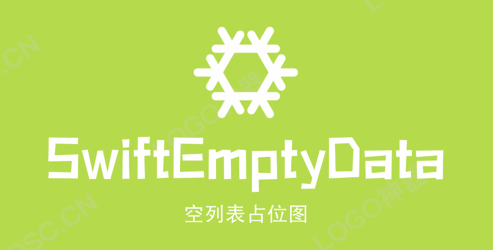

[](http://cocoapods.org/pods/SwiftEmptyData)
[](https://swift.org/package-manager/)


[](https://developer.apple.com/swift/)

这是一个Swift语言封装的EmptyView显示库，可作用于UITableView、UICollectionView，当列表数据为空时展示占位图。

采用了UIStackView容器，通过适配器的方式可以很方便的添加、修改空占位图，以及刷新空占位图样式。


## 安装

### Cocoapods

1.在 Podfile 中添加 `pod ‘SwiftEmptyData’`

2.执行 `pod install 或 pod update`

3.导入 `import SwiftEmptyData`

### Swift Package Manager

从 Xcode 11 开始，集成了 Swift Package Manager，使用起来非常方便。SwiftEmptyData 也支持通过 Swift Package Manager 集成。

在 Xcode 的菜单栏中选择 `File > Swift Packages > Add Pacakage Dependency`，然后在搜索栏输入

`https://github.com/jackiehu/SwiftEmptyData`，即可完成集成

### 手动集成

SwiftEmptyData 也支持手动集成，只需把Sources文件夹中的SwiftEmptyData文件夹拖进需要集成的项目即可

## 用法

```swift
 ///配置展位图  
			tableView.em.emptyView = EmptyView.empty(firstReloadHidden: false,
                                              canTouch: true,
                                              offsetY: -100,
                                              space: 15,
                                              backColor: .orange,
                                              deploy: { (config) in
                                                config.image = UIImage.init(named: "XX")
                                                config.title = "sdfasd"
                                                config.detail = "asdasd"
                                                config.buttonTitle = "asdasdasd"
                                                config.buttonColor = .orange
                                                config.buttonSize = .init(width: 200, height: 50)
                                                config.eventTag = 2
                                              },
                                              closure: { (tag) in
                                                print("点击了tag--\(tag)")
                                              })

///刷新占位图
      tableView.em.emptyView?.reloadEmpty(deploy: { (config) in
                config.title = "XXXXXXXXX"
                config.buttonTitle = "XXXXXXXXX"
                config.buttonColor = .red
                config.buttonSize = .init(width: 100, height: 50)
                config.eventTag = 6
            })

```


## API

```swift
  /// 创建占位图
    /// - Parameters:
    ///   - deploy: 适配器回调
    ///   - firstReloadHidden: 用于请求网络前Reload时暂时隐藏emptyView ,网络回来后会根据当前的tableView/collectionView的 DataSource来自动判断是否显示emptyView,不请求网络默认为false
    ///   - canTouch: 内容区域是否可点击
    ///   - offsetY: 内容视图的偏移量
    ///   - space: 内容间距
    ///   - backColor: 整个遮罩层的背景色
    ///   - closure: 按钮点击回调 或 容器点击回调
    /// - Returns: 占位图
    public static func empty(firstReloadHidden: Bool = false,
                             canTouch: Bool = false,
                             offsetY: CGFloat = 0,
                             space: CGFloat = 0,
                             backColor: UIColor = .clear,
                             deploy : ConfigEmpty,
                             closure: buttonClosure? = nil) -> EmptyView

    /// 刷新空视图
    /// - Parameter deploy: 适配器回调
    public func reloadEmpty(deploy : ConfigEmpty)
```

## 适配器参数

```swift
    /// 图片(设置后占位图会显示图片)
    public var image : UIImage?
    /// 自定义图片size
    public var imageSize : CGSize?
    
    /// 标题(设置后占位图会显示标题)
    public var title : String?
    /// 标题字体
    public var titleFont : UIFont = .systemFont(ofSize: 30)
    /// 标题颜色
    public var titleColor : UIColor = .black
    /// 自定义距离图片间距
    public var titleTopSpace : CGFloat?
    
    /// 副标题(设置后占位图会显示副标题)
    public var detail : String?
    /// 副标题字体
    public var detailFont : UIFont = .systemFont(ofSize: 14)
    /// 副标题颜色
    public var detailColor : UIColor = .lightGray
    /// 自定义间距
    public var detailTopSpace : CGFloat?
    
    /// 按钮标题(设置后占位图会显示按钮)
    public var buttonTitle : String?
    /// 按钮字体颜色
    public var buttonFont : UIFont = .systemFont(ofSize: 15)
    /// 按钮标题颜色
    public var buttonTitleColor : UIColor = .lightGray
    /// 按钮宽高
    public var buttonSize : CGSize?
    /// 按钮圆角
    public var buttonRadius : CGFloat = 5
    /// 按钮背景色
    public var buttonColor : UIColor = .clear
    /// 自定义间距
    public var buttonTopSpace : CGFloat?
    
    /// 按钮处理事件tag
    public var eventTag : Int = 0
    
    /// 自定义视图 (设置后占位图会显示自定义视图,如果以上按钮标题图片都不设置只设置自定义视图则只展示自定义视图,内部点击事件自行处理)
    public var customView : UIView?
    /// 自定义视图宽高
    public var customViewSize : CGSize?
    /// 自定义间距
    public var customViewTopSpace : CGFloat?
```

如果不喜欢内置的布局可以直接重写或者自定义视图添加到EmptyView上

## 更多砖块工具加速APP开发

[](https://github.com/jackiehu/SwiftBrick)

[](https://github.com/jackiehu/SwiftMediator)

[](https://github.com/jackiehu/SwiftShow)

[](https://github.com/jackiehu/SwiftLog)

[](https://github.com/jackiehu/SwiftyForm)

[](https://github.com/jackiehu/SwiftPageView)

[](https://github.com/jackiehu/JHTabBarController)

[](https://github.com/jackiehu/SwiftMesh)

[](https://github.com/jackiehu/SwiftNotification)

[](https://github.com/jackiehu/SwiftNetSwitch)

[](https://github.com/jackiehu/SwiftButton)

[](https://github.com/jackiehu/SwiftDatePicker)
